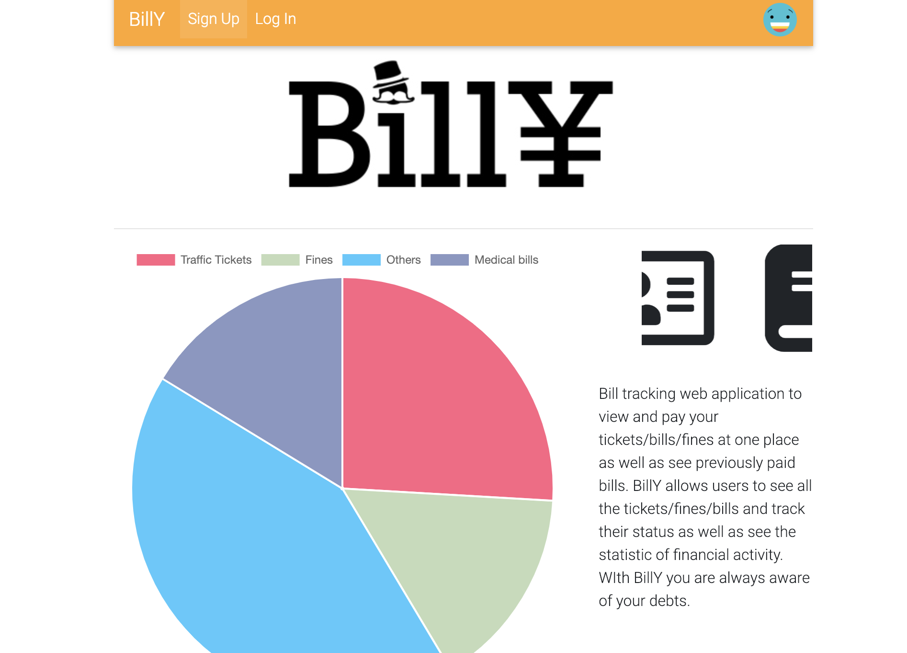
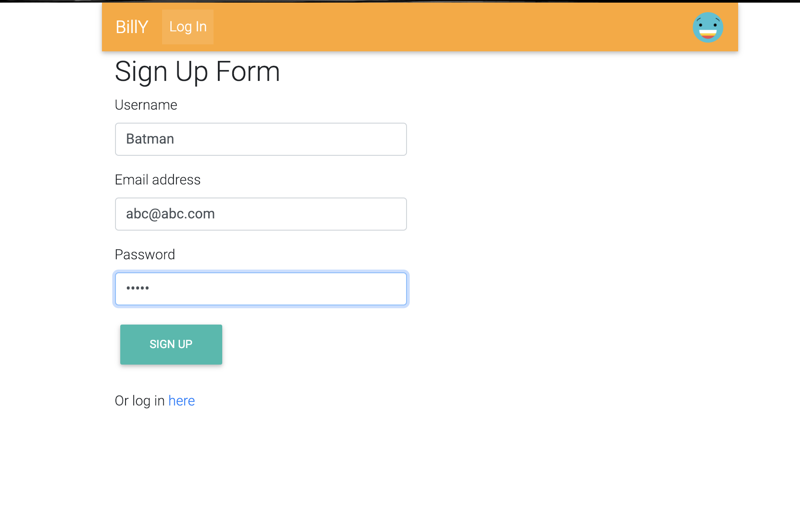
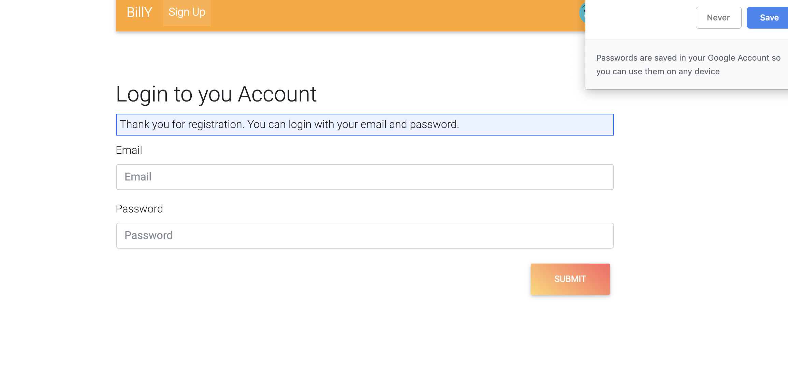
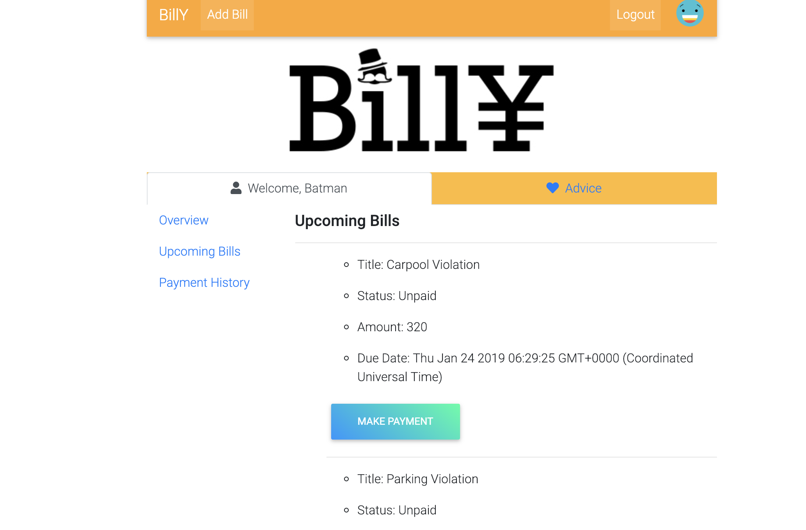
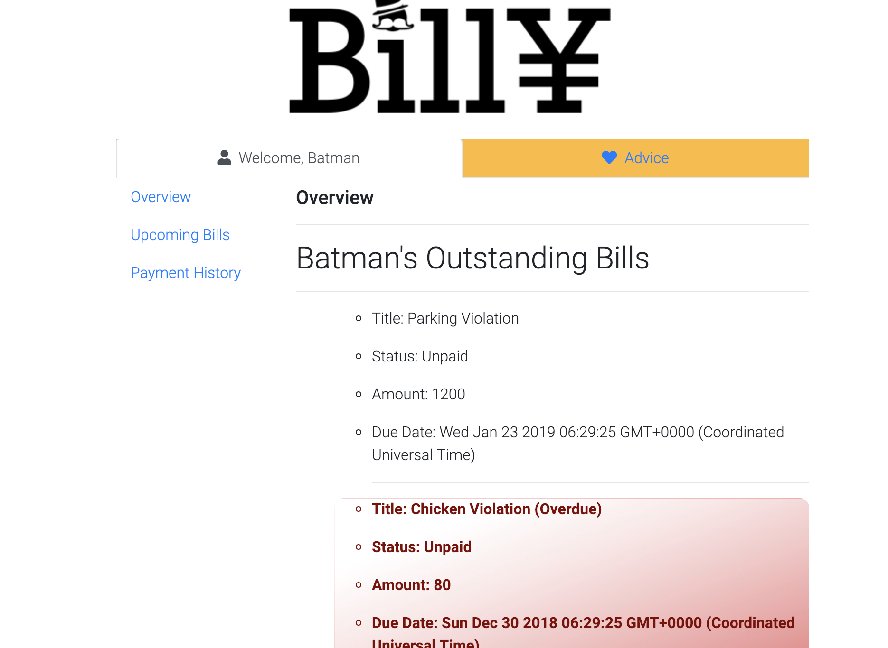

# Project-2-BillY
BillY is an app where you have access to all your tickets, bills and fines. Upon authorization user has access to bills and will be able to make a payment upon clicking "payment" button. User has access to payments history information, as well as overdue payments. 

Too often, life gets busy and it becomes harder to keep track of what you owe. People move from place to place, switch utility companies, banks, credit cards, insurance, etc. Do you have to pay for another month of internet from one company after switching to another company? What if you’ve moved in the middle of the month before rent is do? With BillY, users can see what companies are charging them and be notified of conflicts before their bills become past due.

,
,
,
, 

# Technologies Used
- Javascript
- Sequelize
- Express
- Node
- JSON
- CSS
- Handlebars.js 
- MySQL
- Chart.js
- Passport.js
- Bcrypt.js

Information about user and bill information will be stored in a SQL database. This web application uses  express to communicate within an MVC model, setting up routes between the a user and multiple bills that belong to them. HTML was initially used to set up front end portions of the application but in order to make the user interface cleaner, handlebars.js was used in the design. User authentication through passport.js was applied in order to ensure instances for each user profile and to ensure that users would only be able to access their personal account. In order to ensure security of user passcodes when authenticating an individual user, bcrypt was used to hash passcodes into an encrypted string.

## Authors
* Jarren Patao, Varvara Kourova, Mikhael A Poblete.

# Demo
Please follow the link to [Heroku](https://billy2019.herokuapp.com/) deployment to play with the project.

# License

GENERAL    DISCLAIMER AND LIMITATION OF LIABILITY

ALL INFORMATION IS PROVIDED "AS IS" WITH ALL FAULTS AND WITHOUT WARRANTY OF ANY KIND, EITHER EXPRESSED OR IMPLIED. AUTHORS DISCLAIMS ALL WARRANTIES,EXPRESSED OR IMPLIED INCLUDING, WITHOUT LIMITATION, THOSE OF MERCHANTABILITY, FITNESS FOR A PARTICULAR USE OR ARISING FROM A COURSE OF DEALING, USAGE OR TRADE PRACTICE. AUTHORS SHALL NOT BE LIABLE FOR ANY DIRECT, INDIRECT, SPECIAL, CONSEQUENTIAL OR INCIDENTAL DAMAGES INCLUDING, WITHOUT LIMITATION, LOST PROFITS OR REVENUES, COSTS OF REPLACEMENT GOODS, LOSS OR DAMAGE TO DATA. 

RESTRICTED TO PRIVATE USE ONLY. NOT FOR COMMERCIAL USE.

